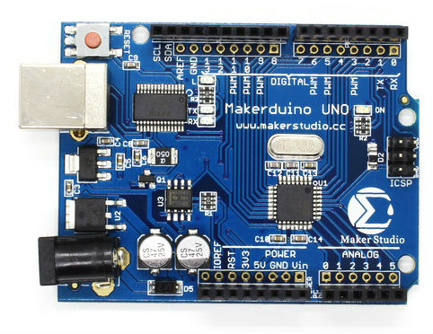

# Oppgaver

Til de praktiske oppgavene skal vi bruke et byggesett som heter Makerduino. Dette kortet er kompatibelt med Arduino Uno R3.
Arduino er et kontrollerkort med en enkel prosessor som kan programmeres. Alle hardware og software spesifikasjoner er åpen tilgjengelige

