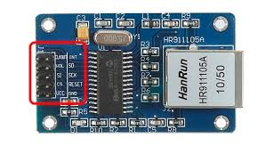

# Ethernet oppgave
En enkel måte å få en enhet på nett er å bruke kablet nett (Ethernet).

Til våre byggesett har vi kjøpt inn en modul som heter ENC28J60.
For å bruke denne trenger du et eget bibliotek kalt [EtherCard](https://github.com/jcw/ethercard).

For å gjøre tilgjengelig i Arduiono utviklingsmiljø laster du ned [biblioteket](https://github.com/jcw/ethercard/archive/master.zip)

* åpne Arduiono IDE
* gå til menyvalg __Skisse -> Administrer bibliotek -> Legg til ZIP bibliotek__ og finn frem ZIP filen du lastet ned

## Tilkoblinger


Du kobler til Ethernet kortet til Arduino kortet som følger:
* ENC SO -> digital pin 12
* ENC SI -> digital pin 11
* ENC SCK -> digital pin 13
* ENC CS -> digital pin 8
* ENC VCC -> 3V3 pin
* ENC GND -> Gnd pin

## Programmering

Når du har fått koblet opp gjenstår trenger vi et program. I første omgang for å hente en IP via DHCP.

```arduino
#include <enc28j60.h>
#include <EtherCard.h>
#include <net.h>
// de overnfor nevnte biblotekene MÅ være inkludert

byte mymac[] = // Skriv inn MAC

void setup() {


  // ... initialiser kort
  ether.begin(sizeof Ethernet::buffer, mymac);
  // alt annet enn returverdi 0 betyr feil

  // ... gjør DHCP request. Returner boolean. True er suksess
  ether.dhcpSetup();
}

void loop() {

  // Hva skal vi gjøre med IP-en?
}

```

Dersom dette går strålende kan vi prøve å kombinere dette med en av de foregående oppgavene. Noen ideer her?

## Ekstra poeng
Om du er helt tom for ideer kan du se på Sondre sitt forslag som kombinerer måling av temperatur og luftfuktighet med HTTP POST kall mot datainnsamlingstjener.
